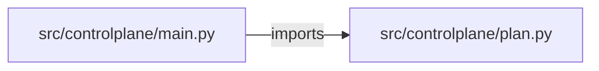

# multi-cloud-control-plane — project architecture

[README](README.md) · [Interview questions and answers](INTERVIEW_QA.md)

## Purpose and scope

One request names a cloud, a resource (`bucket` or `cluster`), and a name. The response is a plan with the Terraform type for that cloud. `applied` is false. No credential is read.

This document describes files and symbols in this checkout. Deployment templates and statements in the original overview are distinguished from a verified running environment.

## Component diagram



For Python repositories, arrows show resolved local imports, not network calls or deployment order. Otherwise the diagram is a repository component map; containment arrows do not assert runtime integration.

## Components and responsibilities

| Component | Responsibility |
| --- | --- |
| [`src/controlplane/main.py`](src/controlplane/main.py) | HTTP handlers: `POST /plans` |
| [`src/controlplane/plan.py`](src/controlplane/plan.py) | Functions: `build_plan` |
| [`requirements.txt`](requirements.txt) | Implementation or supporting configuration |
| [`tests/test_plan.py`](tests/test_plan.py) | Executable checks and regression examples |
| [`.github/workflows/ci.yml`](.github/workflows/ci.yml) | GitHub Actions job definitions |
| [`README.md`](README.md) | Project explanations or operating notes |

## Request interface

| Method and path | Handler | Source |
| --- | --- | --- |
| `POST /plans` | `create_plan` | [`src/controlplane/main.py`](src/controlplane/main.py#L16) |

The table lists literal route decorators found in the inspected Python modules. Router prefixes and middleware can add behavior; check the linked handler and application setup before calling an endpoint.

## Implementation walkthrough

### `build_plan(cloud, resource, name)`

Source: [`src/controlplane/plan.py`](src/controlplane/plan.py#L8).

```python
def build_plan(cloud, resource, name):
    kind = RESOURCES[cloud][resource]
    return {
        "cloud": cloud,
        "resource": resource,
        "name": name,
        "terraform_type": kind,
        "applied": False,
    }
```

## Validation and failure paths

| Explicit exception | Source |
| --- | --- |
| `HTTPException(status_code=422, detail='cloud must be gcp, aws, or azure')` | [`src/controlplane/main.py`](src/controlplane/main.py#L18) |
| `HTTPException(status_code=422, detail='resource must be bucket or cluster')` | [`src/controlplane/main.py`](src/controlplane/main.py#L20) |

These are explicit exceptions in the inspected source, rather than a claim that every failure is handled. Follow the calling handler to see whether the exception becomes an HTTP response or propagates.

## Data and state

- [`src/controlplane/plan.py`](src/controlplane/plan.py) defines module-level containers: `RESOURCES`.

Module-level dictionaries/lists live in a Python process. They can be fixtures or mutable state; inspect writes before treating them as persistent storage. A production extension would need to define persistence and concurrency behavior explicitly.

## Data flow and design decisions

### What is the input-to-output contract of `build_plan`

In [`src/controlplane/plan.py`](src/controlplane/plan.py#L8), `build_plan(cloud, resource, name)` receives the inputs. The function computes these intermediate values:

- `kind = RESOURCES[cloud][resource]`

Its result is defined by:

- `{'cloud': cloud, 'resource': resource, 'name': name, 'terraform_type': kind, 'applied': False}`

## Setup and verification

The following commands are derived from the checked-in dependency/test contracts. Execute them from the repository root; the block prepares a local environment, not a cloud deployment.

```bash
python3 -m venv .venv
source .venv/bin/activate
python -m pip install -r requirements.txt
python -m pytest -q
```

Python dependencies: [`requirements.txt`](requirements.txt).

Test entry points: [`tests/test_plan.py`](tests/test_plan.py).

Automation definitions: [`.github/workflows/ci.yml`](.github/workflows/ci.yml). Read their triggers and job steps to determine what CI actually runs.

## Operating boundaries and design review

Before turning this checkout into a customer deployment, establish the input contract, data ownership, access controls, failure response, evaluation criteria, and rollback owner. Repository fixtures and unit tests demonstrate local behavior; they do not establish throughput, uptime, compliance, or business impact.

A useful architecture review starts with the linked implementation: identify where input enters, where a decision is made, which state can change, and which external dependency can fail. Add a deployment view only for infrastructure that is actually configured and exercised.
